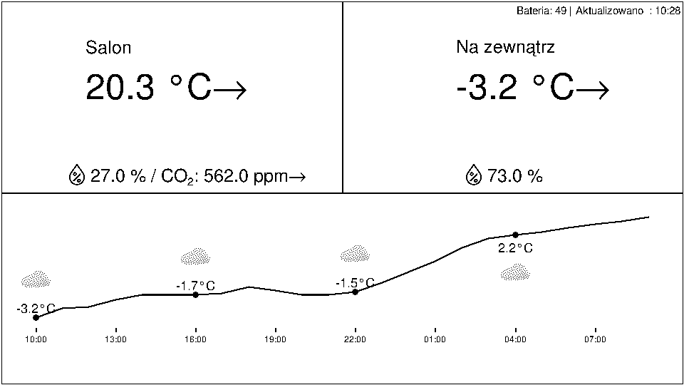

# netatmo

NetAtmo weather station display with weather forecast, based on a Raspberry Pi and an e-Paper screen.

<details><summary>Table of contents</summary>

* [Introduction](#introduction)
* [Features](#features)
* [Installation](#installation)
  * [Raspbian/Raspberry Pi OS](#raspbian)
  * [Waveshare Setup](#waveshare)
  * [Download the app!](#download)
  * [NetAtmo API](#netatmoapi)
  * [Met.no Weather API](#metno)
* [Files](#files)
* [Running the program](#running)
* [Launching on system startup](#startup)
* [References](#references)

</details>

<a name="introduction"></a>

# Introduction

The [NetAtmo Smart Weather Station][1] is a weather station with an indoor and an outdoor module, and optional rain gauge, anemometer and additional indoor modules. All the data from the different modules is available on the [web portal][2] and on the mobile app.

[1]: https://www.netatmo.com/en-eu/smart-weather-station

[2]: https://home.netatmo.com/control/dashboard

The modules themselves don't have any kind of display, so this project is an attempt to make a compact dedicated display for the NetAtmo weather station with at least indoor and outdoor temperatures, using a Raspberry Pi and a e-Paper screen. Credit for the original project: https://github.com/psauliere/netatmo 

The first setup I tried is this one:

- [Raspberry Pi Zero W][3]. The Zero W can be found with a soldered header if soldering is not your thing: it is called a [Raspberry Pi Zero WH][4].

- [Waveshare 5.83inch e-Paper HAT][10]

[3]: https://www.berrybase.de/raspberry-pi-zero-2-w

[4]: https://www.berrybase.de/raspberry-pi-zero-2-wh

[10]: https://www.waveshare.com/wiki/5.83inch_e-Paper_HAT_(B)

<!--  -->

The Waveshare is well attached and the whole setup is much more robust.

I chose Python 3 for the code as it is available and up to date on every Raspbery Pi OS.

<a name="features"></a>

# Features

This weather station display includes:

- **Indoor Data**: Temperature, humidity, CO₂ levels with trend indicators
- **Outdoor Data**: Temperature with trend indicators, humidity, rain (24h), wind speed
- **Weather Forecast**: 24-hour temperature forecast displayed as a curve graph
  - Temperature curve with data points
  - Weather symbols every 6 hours
  - Time markers every 3 hours
  - Forecast normalization using current outdoor temperature (Kelvin-based percentage offset to avoid zero-crossing distortion)
- **Configurable Display Support**:
  - Waveshare e-Paper displays (epd2in7, epd5in83, epd5in83b)
  - File-only mode (generates image.bmp without physical display)
- **Automatic Token Refresh**: OAuth token management with automatic refresh
- **Weather Data Integration**: Uses Met.no weather forecast API
- **Simple Architecture**: Sequential execution with no threading complexity

<a name="installation"></a>

# Installation

<a name="raspbian"></a>

## Raspbian/Raspberry Pi OS for the Raspberry Pi

You need to prepare a microSD card with Raspberry Pi OS Lite. It is important to get the 'Lite' version because you don't want the graphical interface on a fully headless device. The simplest way to do that is to use the Raspberry Pi Imager tool:

Insert a new microSD card in your PC or Mac (8 GB or more).

Download, install and run the [Raspberry Pi Imager](https://www.raspberrypi.com/software/) for your OS.

- Under Raspberry Pi Device, choose your target device.
- Under Operating System, click **Choose OS**, select **Raspberry Pi OS (other)**, and then **Raspberry Pi OS Lite (64 bit)**.
- Under Storage, choose your microSD card.
- Click **NEXT**.

Next, you will have the option to use OS custom settings: click **EDIT SETTINGS**.

- At least set the username and password. To make things simple, you can name the user `pi` and choose a password that will be easy to remember.
- Configure your wifi network. Not that it only connects to 2,4Ghz wifi (not 5Ghz)
- In the SERVICE tab, check the **Enable SSH** box.
- Chose if you want to authenticate with the password or a SSH key. If you already have a SSH key, paste your public key.
- Click **SAVE**.

Click **YES** to use the OS customization settings.

If you are sure you selected the right target microSD, click **YES** in the Warning window.

The tool then does the downloading, the writing and the checking, so it may take some time.

When the tool displays "Write Successfull", remove the microSD from the PC, click **CONTINUE** and close the Window.

Insert the microSD in the Raspberry Pi and plug the power supply. The first boot should take a few minutes. It should connect to your Wifi network and you should be able to **get its IP address from your router**.

Connect to the device from your PC or Mac:

```
ssh <username>@<IP_address>
```

If this doesn't work, boot the Raspberry with its microSD, a keyboard and an HDMI screen, login with your username and password, and use the `raspi-config` utility to configure the network.

Once connected with SSH, install the latest OS updates, and reboot:

```
sudo apt update && sudo apt full-upgrade -y && sudo reboot
```

Reconnect after the reboot. Python 3 should already be installed. You can check its version with:

```
python3 -V
```

Install [git][14], the [Freefont TrueType fonts][15], [PIL][16], and the [Requests][17] module (needed to call the NetAtmo API):

```
sudo apt install git fonts-freefont-ttf python3-pil python3-requests
```

[14]: https://git-scm.com/

[15]: http://savannah.gnu.org/projects/freefont/

[16]: https://python-pillow.org/

[17]: https://github.com/psf/requests


<a name="waveshare"></a>

## Waveshare Setup

If you have a Waveshare screen, for example the 5.83 e-Paper HAT, the instructions are here:

https://www.waveshare.com/wiki/5.83inch_e-Paper_HAT_(B)

and the software is here :

https://github.com/waveshare/e-Paper

The hardware setup is very simple. Just plug the board on the 40-pin GPIO header. The software setup is documented on the wiki above, and here is the short and simplified version:

Activate the SPI interface:

```
sudo raspi-config
```

Choose `Interface Options` > `SPI` > `Yes` to enable SPI interface.

Reboot:

```
sudo reboot
```

Reconnect and install Python 3 libraries:

```
sudo apt update
sudo apt install python3-numpy python3-rpi.gpio python3-spidev
```

Download the Waveshare repo in your home dir:

```
cd
git clone https://github.com/waveshare/e-Paper
```

(Optional) test the display:

```
cd e-Paper/RaspberryPi_JetsonNano/python/examples
python3 epd_2in7_test.py
```

This should display some test patterns on the Waveshare screen.

Come back to the home dir:

```
cd
```

<a name="download"></a>

## Download the app!

Download the code in your home dir:

```
cd
git clone https://github.com/wgmv/netatmo.git
cd netatmo
```

To test the display module, type this:

```
cp sample_data.json data/data.json
./display.py
```

This should display a sample based on the sample data included in the repo.

<a name="netatmoapi"></a>

## NetAtmo API

- Create a config directory and run python netatmo.py - it will create config/config.json which needs to be updated with the above data. Same for config/token.json
First you need to get the device_id of your indoor module. This is the  MAC address of your device. You can get it either from your router or from the mobile app:

On the Android NetAtmo app, you need to tap the menu icon on the top left, then _Manage my home_, and then your indoor module. Look for its _Serial number_ and take note of the value, which begins with `70:ee:50:`. Note that the device_id is case sensitive (here usually all letters lowercase).

Then on your computer, go to https://dev.netatmo.com/apps/, authenticate with your NetAtmo username and password, and create a new app. Take note of the _client id_ and the _client secret_ for your app.

You now need to authorize the app to access your NetAtmo data:

- Under _Token generator_, select the **read_station** scope and click **Generate Token**.
- It might take a while, and you will get a page where you have to _authorize_ your app to access to your data.
- Click **Yes I accept**. You now have a new _Access Token_ and a new _Refresh Token_, that you can copy to your clipboard by clicking on them.


Edit the `config.json` file with your values:

```json
{
    "client_id": "your app client id",
    "client_secret": "your app client secret",
    "device_id": "your indoor module serial number",
    "refresh_time": 600,
    "screen_type": null,
    "location": {
        "longitude": 0.0,
        "latitude": 0.0,
        "altitude": 0
    }
}
```

Configuration parameters:
- `client_id`, `client_secret`, `device_id`: NetAtmo API credentials (required)
- `refresh_time`: Seconds between station data updates (default: 600)
- `screen_type`: Display type - `"epd2in7"`, `"epd5in83"`, `"epd5in83b"`, or `null` for file-only mode
- `location`: Your location for weather forecast (latitude/longitude rounded to 4 decimals, altitude in meters)
## Configuration Files

- `config/config.json`: Main configuration file with API credentials, refresh settings, display type, and location
- `config/token.json`: OAuth tokens (access and refresh tokens), automatically updated by the application

## Source Files

- `src/netatmo.py`: Main service module - fetches station data every 10 minutes, weather data every hour, manages token refresh
- `src/display.py`: Display rendering module - creates the weather display image with forecast curve graph
- `src/weather.py`: Weather service - fetches forecast data from Met.no API
- `src/reader.py`: NetAtmo API client - handles station data retrieval and authentication
- `src/formatters.py`: Data formatting utilities
- `src/utils.py`: Common utilities (JSON I/O, time formatting, text sizing)

## Data Files (created automatically)

- `data/data.json`: Latest weather station data from NetAtmo API
- `data/weather_data.json`: Latest weather forecast from Met.no API
- `image.bmp`: Generated display image

## Display Features

The display shows:

- **Top Left**: Indoor temperature with trend arrow, humidity 💧, and CO₂ levels
- **Top Right**: Outdoor temperature with trend arrow
- **Bottom**: 24-hour temperature forecast as a curve graph
  - Continuous temperature curve line
  - Weather symbols every 6 hours
  - Temperature labels every 6 hours  
  - Time markers every 3 hours
  - Forecast automatically normalized using current outdoor temperature

Example display:


- `display.py` or `custom_display.py`

If `config/config.json` does not exist, `netatmo.py` creates an empty one and you have to edit it. `config.json` is the configuration file. You must edit this file with your values (see above).

If `config/token.json` does not exist, `netatmo.py` creates an empty one and you have to edit it. `token.json` contains the _access token_ for the program to access to your NetAtmo, and the _refresh token_ for the program to renew the _access token_ when it expires (every 3 hours). This file is written by `netatmo.py` every time it refreshes the _access token_. The refresh operation is managed by the program, but the initial tokens have to be generated and validated interactively online (see above).

`netatmo.py`: main module. Every 10 minutes, it calls the [NetAtmo `getstationdata` API](https://dev.netatmo.com/apidocumentation/weather#getstationsdata) to get the weather station data, stores it to the `data.json` file, and calls `display.py`. It refreshes the access token when it expires.

`display.py`: display module, called by `netatmo.py` every 10 minutes. It reads `data.json` and displays the data on the screen. So if you choose another screen, or wish to change the display, you just have to adapt or rewrite this file. If no supported screen is present, `display.py` draws the image of the display into a `image.bmp` file. See below (`image.bmp`) for an example of display.

If you want to customize the display, just copy `display.py` to `custom_display.py` and edit the copy. If `netatmo.py` finds a file named `custom_display.py`, it calls this one instead of `display.py`.

Files created by the program:

`token.json`: _access token_ and _refresh token_. This file is written by `netatmo.py` every time it refreshes the tokens.

`data.json`: weather station data file. This file holds the JSON result of the latest NetAtmo `getstationdata` API call.

`image.bmp`: image of the latest screen display, written by `display.py`. Example:


In this example, the display shows:

- the time of the `getstationdata` API call.
- the indoor temperature and trend
- the outdoor temperature and trend
- the rain in mm/h

<a name="running"></a>
the main service:

```bash
python3 src/netatmo.py
```

Or use a `tmux` session to let it run even when you disconnect your SSH session:

```bash
tmux new -s netatmo
python3 src/netatmo.py
```

The program will:
- Fetch station data every 10 minutes (configurable via `refresh_time`)
- Feutomatically launch the program on system boot, use the `launcher.sh` script which creates a tmux session and starts the service.

First install `tmux` if not already done:
```bash
sudo apt install tmux
```

Edit the script to use your Python path if needed, then set up autostart by editing `/etc/rc.local`:

```bash
sudo nano /etc/rc.local
```

Add this line *before* the `exit 0` line:

```bash
su -c /home/pi/netatmo/launcher.sh -l pi
```

This runs the script as the `pi` user.

After reboot, attach to the session:

```bash
tmux attach -t NETATMO
```

Detach with: `Ctrl+B`, then `d`

<a name="references"></a>

# References

## APIs
- [NetAtmo Developer Documentation](https://dev.netatmo.com/)
- [Met.no Locationforecast API](https://api.met.no/weatherapi/locationforecast/2.0/documentation)

## Hardware
- [Waveshare e-Paper displays](https://www.waveshare.com/wiki/Main_Page#OLEDs_.2F_LCDs)
- [Waveshare 2.7" e-Paper HAT](https://www.waveshare.com/wiki/2.7inch_e-Paper_HAT)
- [Waveshare 5.83" e-Paper HAT](https://www.waveshare.com/wiki/5.83inch_e-Paper_HAT)

## Related Projects
- [Original netatmo project by psauliere](https://github.com/psauliere/netatmo)
- [netatmo-display by bkoopman](https://github.com/bkoopman/netatmo-display)
- [netatmo by SteinTokvam](https://github.com/SteinTokvam/netatmo)

## Tools

This will run the script as the `pi` user.

Later, when you ssh to the system as the `pi` user, you can attach to the NETATMO tmux session this way:

```
tmux a
```

and detach from the session with this key sequence: `Ctrl+B`, `d`.

<a name="references"></a>

# References

- [NetAtmo developer documentation](https://dev.netatmo.com/)
- [Met.no Weather API](https://api.met.no/weatherapi/locationforecast/2.0/documentation) - [Terms of Service](https://api.met.no/doc/TermsOfService)
- [Waveshare 2.7inch e-Paper documentation](https://www.waveshare.com/wiki/2.7inch_e-Paper_HAT)
- [Another NetAtmo Display project: netatmo-display](https://github.com/bkoopman/netatmo-display)

More on tmux:

- [A Quick and Easy Guide to tmux](https://www.hamvocke.com/blog/a-quick-and-easy-guide-to-tmux/)
- [The Tao of tmux](https://leanpub.com/the-tao-of-tmux/read)
